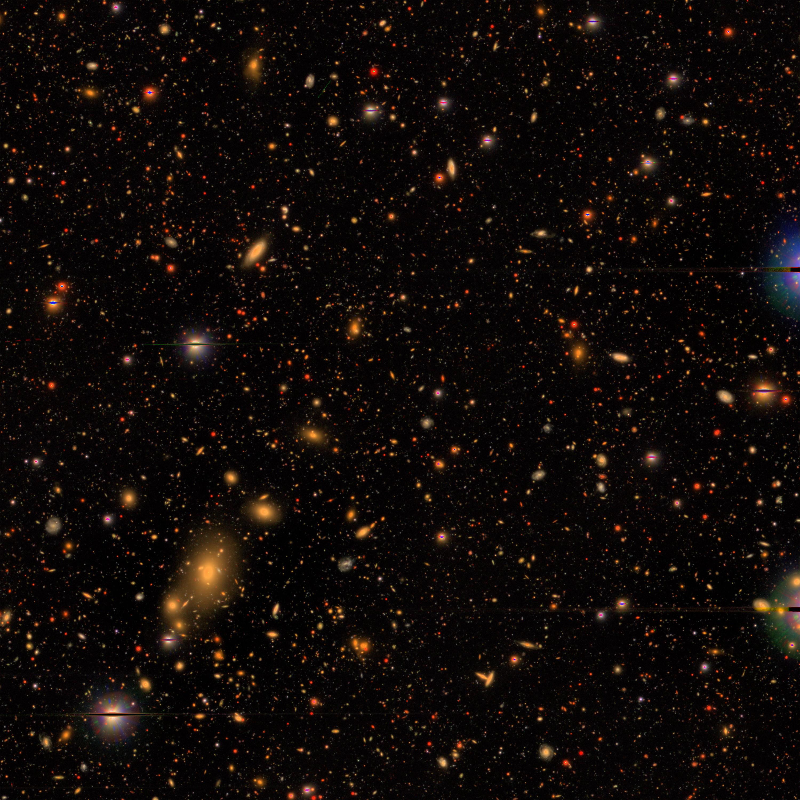

# Learning Astronomy by Reconstructing the Sky

Welcome to the Sky Embeddings repository, where we leverage self-supervised learning to generate and utilize embeddings from sky images for tasks such as classification, redshift estimation, and similarity searches.

## Overview

This repository hosts code and methodologies for applying Masked Image Modelling (MIM) to astronomical images, focusing on producing high-quality embeddings that capture the rich, underlying structures of the universe.

We combined aspects from the [MAE code developed by Facebook AI](https://github.com/facebookresearch/mae) and the [SimMIM Framework for Masked Image Modeling](https://github.com/microsoft/SimMIM) as our primary machine learning pipeline. Leveraging these developments with a few tricks of our own allowed us to create meaningful embeddings from observations of the sky.

## Requirements

### Compute
All of these instructions are geared towards use on the [Digital Research Alliance of Canada](https://docs.alliancecan.ca/wiki/Getting_started)'s (DRAC) Narval server. 


Ensure you have the following installed:

- Python: `3.11.5`
- PyTorch: `pip install torch==2.0.1`
- h5py: `pip install h5py`
- Scikit-learn `pip install scikit-learn`

A full environment on the Narval server can be provided upon request.

### Data

Our primary dataset comes from the Hyper Suprime-Cam (HSC) on the Subaru Telescope and is available upon request. Below is an example image from the HSC:

<p align="center">
  <br>
  <span style="display: block; text-align: right;"><a href="https://subarutelescope.org/en/news/topics/2017/02/27/2459.html">subarutelescope.org</a></span>
</p>


## Quick Start 
These steps are just geared towards reproducing the results from our Foundation Models for Science workshop submission at NeurIPS 2024.

### Setup
You have two options for how to get up and running on Narval: 
1. Through your normal terminal (as described below, no additional setup needed)
2. Through VSCode (requires some [additional steps](https://code.visualstudio.com/docs/remote/ssh) before jumping into steps below, but then makes your life much easier)

Setup an [SSH key](https://docs.alliancecan.ca/wiki/SSH_Keys) and [multifactor authentication](https://docs.alliancecan.ca/wiki/Multifactor_authentication) with DRAC if you have not already.

SSH onto Narval using your username in place of `username`
```
ssh username@narval.computecanada.ca
```
Navigate to the directory you want to store your code in (if this is your fist time you will need to make it using `mkdir`)
```
cd /project/def-olin/username/code
```

Pull this code from GitLab
```
git clone https://anonymous.4open.science/r/temp-anom-7D1D
```
The following subsections will provide commands to submit jobs on Narval, and you may monitor their status at anytime using the command
```
sq
```

### Training
To run training you need to launch the following job under your DRAC `account_name`
```
sbatch --time=72:00:00 --cpus-per-task=6 --account=account_name --mem=100G --gres=gpu:1 mim_train.sh
```
During training, several types of figures will be created to track the progress. 

The [evaluation metrics will be plotted](./figures/mim_1_progress.png), which includes the loss values for the training and validation data. If `lp_class_data_file` and/or `lp_regress_data_file` are provided in the training configuration, this plot will also include the results of a simple linear probing technique, which only takes a couple seconds to train. This allows us to track how effectively our embeddings can be used to classify (stars, qsos, and galaxies) and predict redshift of galaxies. Both linear probing models are trained on only 4.8k images and validated using 1.2k images.

Additionally, some of the masked image modelling results will be plotted throughout training, similar to [this one](./figures/mim_1_1000000iters.png).

### Evaluation

To run the additional analysis needed for the comparison of model performance versus training labels on the downstream classification task, you need to run a script that trains these models and then runs the comparison 

```
sbatch --time=03:00:00 --cpus-per-task=6 --account=account_name --mem=100G --gres=gpu:1 cls_train_samples.sh
```
Once complete, this will output a figure like [this one](./figures/).

<br><br>

## Contribution and Support

We welcome contributions and suggestions! Please raise issues or submit pull requests on GitHub for any features or problems. For support, refer to the repository's issues section or contact the maintainers directly.
